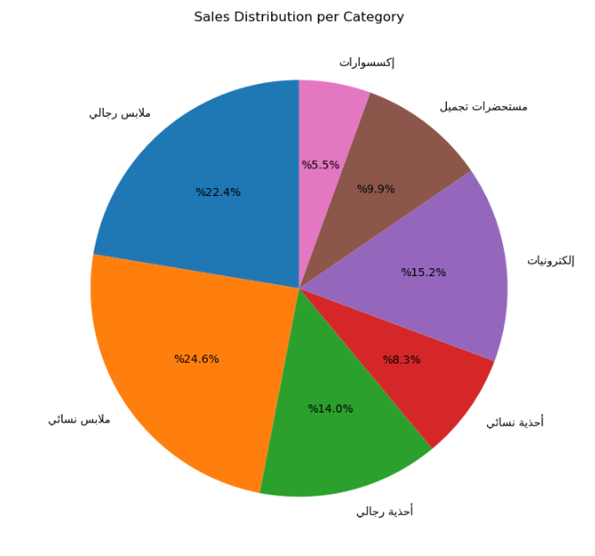

# Smart E-Commerce AI Recommender

An AI-driven recommendation system for e-commerce platforms. This project integrates multiple machine learning models and techniques to deliver smart product suggestions, user insights, and sales forecasting — all exposed via a Flask API.

---

## 📁 Project Structure

| Folder | Description |
|--------|-------------|
| `01 Data analysis (user by country)` | Visual insights on user distribution across countries |
| `02 Data analysis (users info)` | Exploration of user attributes (age, gender, etc.) |
| `03 Data analysis (product info)` | Analysis of product types, sales, and popularity |
| `04 Association` | Association rules to find product co-purchases |
| `05 Classification` | Predict recommended products based on user features |
| `06 Time Series` | Forecasting future sales using historical data |
| `server/` | Flask app to serve predictions via REST API |
| `imgs/` | Charts and visualizations from data analysis |

---

## 💡 Features

- ✅ **Association Rules**: Detects relationships between products (e.g., products bought together).
- ✅ **Classification**: Recommends products to users based on age, gender, and country using ML classifiers.
- ✅ **Time Series Forecasting**: Predicts future sales using statistical and ML models.
- ✅ **REST API**: Flask-based API that exposes all prediction models for integration.

---

## 🛠 Tech Stack

- **Languages/Libraries**: `Python`, `pandas`, `scikit-learn`, `statsmodels`, `mlxtend`
- **Backend**: `Flask`
- **Visualization**: `Matplotlib`, `Seaborn`
- **Notebooks**: `Jupyter Notebook`
- **Data Source**: WordPress-based e-commerce store (MySQL database)

---

## ⚙️ Prerequisites

- Python 3.8+
- Access to your e-commerce MySQL database (e.g., from WordPress/WooCommerce)
- Recommended: create a virtual environment

---

## 🚀 Getting Started

```bash
# Clone the repository
git clone https://github.com/mustafataha5/smart-ecommerce-ai-recommender.git
cd smart-ecommerce-ai-recommender

# Install dependencies
pip install -r requirements.txt

# Configure database connection (see db_config_sample.py)

# Run the Flask API
cd server
python app.py
## 📷 Demo

### 🎯 Customer Demographics


### 🛍️ Sales Insights




